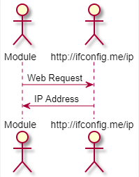
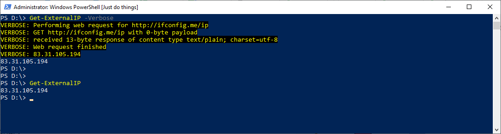

<!--Category:Powershell--> 
 <p align="right">
    <a href="https://www.powershellgallery.com/packages/ProductivityTools.PSGetExternalIP/"></a>
    <a href="http://productivitytools.tech/get-externalip/"><a> 
    <a href="https://github.com/pwujczyk/ProductivityTools.PSGetExternalIP"></a>
</p>
<p align="center">
    <a href="http://productivitytools.tech/">
        
    </a>
</p>

# Get-ExternalIP
 
The module returns the external IP address of the requesting computer.
<!--more-->

 It performs a call to http://ifconfig.me/ip and returns data.
 
 <!--og-image-->
 

 Usage:

 ```Powershell
 Get-ExternalIP
 ```

 

